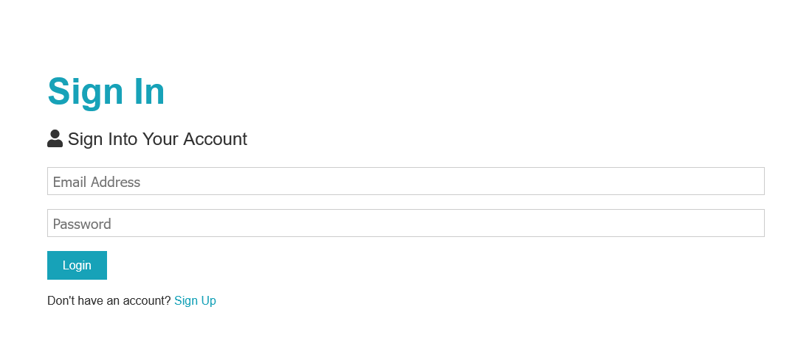

# [Traversy Media MERN Course](https://www.udemy.com/course/mern-stack-front-to-back/)

## Full Stack Web Application

## LEARNING | [Udemy Course](https://www.udemy.com/course/mern-stack-front-to-back/)

## Purpose

This application was created by [Brad Traversy](https://www.udemy.com/user/brad-traversy/). I completed this course to further my understanding of a MERN Full Stack Web Application.

## Technologies Used

- JavaScript
- React
- Moment
- Express
- MongoDB
- Mongoose
- Nodemon
- BCryptjs
- Gravatar

## About

Hello, my name is David. \
You can email me at dwhipp88@gmail.com. \
You can view my [github](https://github.com/D-Whipp). \
My portfolio is currently under construction. I'll link it here once I have it up and running again.

## Badges

## Deploying Progress Notes

*** UPDATE ***
Finished a project. Working on deployment.

*** UPDATE *** 
After researching Heroku alternative deployments I've settled on a technique I found on [Youtube](https://www.youtube.com/watch?v=l1CYFQ1F9N8). \
I'm waiting for an email from Adaptable. For now I've done everything I can do. I'll post once I get the email for beta access.

*** UPDATE ***
Tried a few services (Render, Adaptable, Railway). Builds keep failing. Not sure why. I'll keep at it.

*** UPDATE ***
I've successfully deployed the backend!

*** UPDATE ***
I've successfully deployed the frontend!
The [Site](https://startling-sorbet-ade77f.netlify.app/) has breaking errors, I'll provide the final update once I fix those.

*** UPDATE ***
I've updated the app and switched the db connection to MY mongodb. There's a bug on the frontend causing a *page not found* error.
This error occurs because Netlify does not support React Router out of the box. Luckily there's a simple fix. The [fix](https://www.freecodecamp.org/news/how-to-deploy-a-routed-react-app-to-netlify/) isn't working for me.
I'll continue working on the error and post here once I'm done.

*** UPDATE ***
Fixed the routes issue I was having before by adding the netlify.toml file. Now there's a 'cannot read properties of undefined'. More errors to fix but I'm one step closer.

*** UPDATE ***
Seems Reducers went rogue. Not sure if this is a frontend issue or a backend issue. I suspect my frontend is having trouble talking to the backend. Everything still works fine locally but the deployment runs into a few issues. An error called: 'NOT TYPE OF CASE IN REDUCER' and a server error of 500 show up when trying to register or sign up. The credentials are correct and I'm seeing expected behavior when I misspell the email or enter an incorrect password. It's when the correct credentials are entered that I see the errors.

*** UPDATE ***
I've gone through the logs on Adaptable's website (it's where I deployed my backend) and I've gone through the logs on Netlify (where I deployed my frontend). Correcting ALL the errors I saw in the logs. I've included more env variables in my deployment. I've updated my cors. I've swapped databases to see if that was the issue. I got the app to post a new user but that's as far as it goes. The login functionality and everything after that doesn't work. My routes are returning a 500 or 401 error. I've also made sure my mongodb network access was setup correctly (whitelisted).

*** UPDATE ***
The 401 error is expected. It pertains to authorization. The 500 error is a problem. I've corrected all errors in the backend and frontend deployment logs. Still the generic 500 error persists. I've spent 2 and a half weeks fixing these issues. That's time I need to spend more time learning. I have a feeling I'll be able to solve this problem if I have a better handle on Reducers and Dispatching. I'm going to continue learning and I plan to return to this deployment issue every week. I'll leave these updates up for one more week then I'll likely relocate them to their own repo or gist as they've grown and I can't leave them on the front page.
